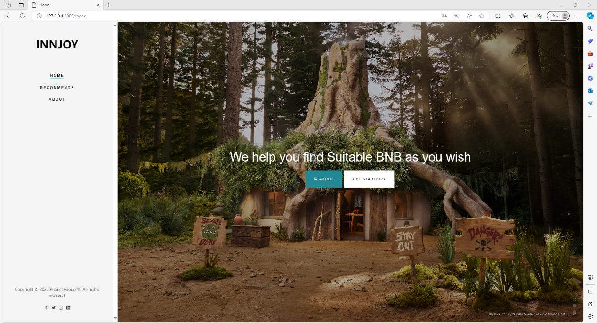
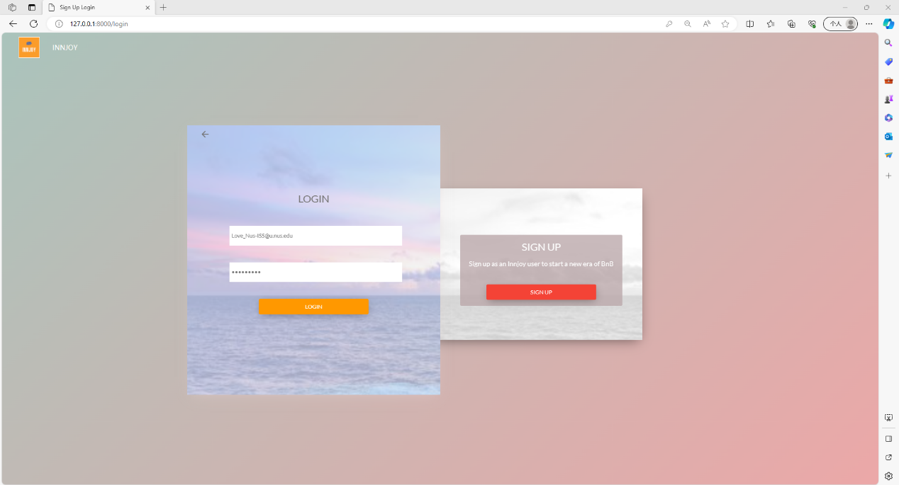
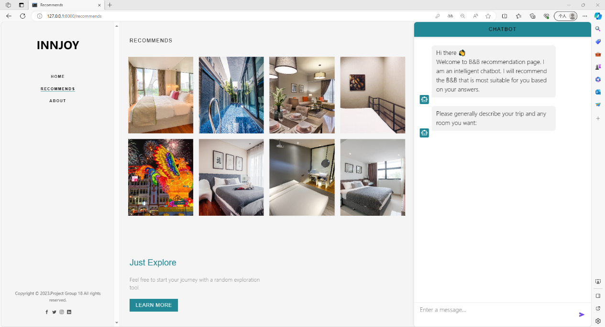
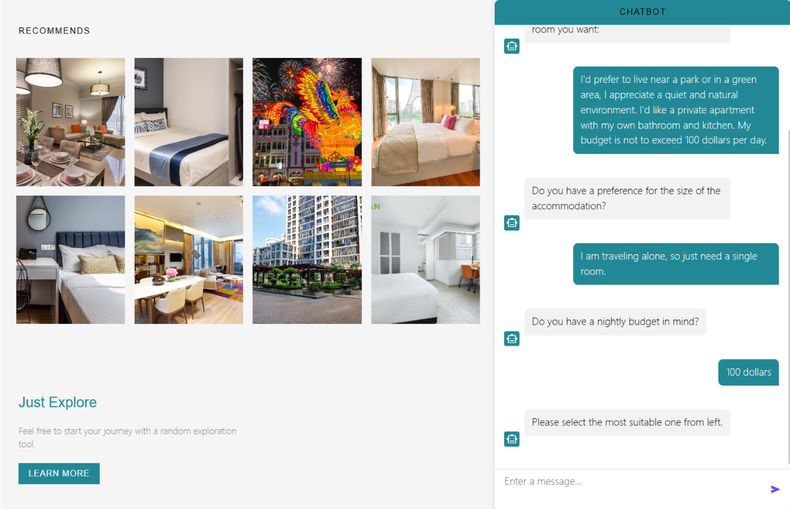

# InnJoy-A-chatbot-driven-system-for-real-time-personalized-BnB-recommendations
InnJoy—A chatbot-driven system for real-time personalized BnB recommendations

In today's era, the applications of deep learning and large language models are not merely confined to theoretical studies. Their practical applications have been widely demonstrated across various industries. Our team is dedicated to exploring these advanced technologies' real-world applications in the online BnB booking domain. As an indispensable service in daily life, users are increasingly demanding a more personalized and efficient recommendation system for online BnB platforms. Addressing this need, after extensive research and experimentation, our team developed "InnJoy—A chatbot-driven system for real-time personalized BnB recommendations." 
Unlike traditional booking platforms, InnJoy strives to seamlessly integrate a chatbot powered by large language models with advanced neural collaborative filtering recommendation algorithms. This combination offers real-time and highly accurate BnB recommendations. Users no longer have to invest extensive time in intricate searches and filters. Instead, they interact with the chatbot, allowing InnJoy's system to swiftly and comprehensively understand users' immediate needs and emotional states, subsequently delivering the most suitable BnB choices. The system's core comprises two main components: firstly, a chatbot capable of instantaneously recognizing and deeply understanding users' needs and emotions; secondly, an efficient BnB recommendation engine based on neural collaborative filtering technology. Through real-time dialogues with users, the chatbot poses a series of precise questions to accurately capture users' preferences and requirements. In the background, based on the user's feedback, the recommendation system curates a personalized list of BnB suggestions. These recommendations are instantaneously displayed on the user's front-end interface, facilitating users to select their desired BnB and providing direct links to individual BnB websites or other major booking platforms. 
Product Features: 
1. Efficient Interaction: Through our front-end web-based chatbot, we effectively engage with users, capturing their needs and emotional states through a series of precise questions. 
2. Real-time Recommendations: In the backend, the recommendation algorithm processes the information provided by users instantly, refreshing the list of recommended BnBs, including their names, prices, and booking links. 
3. Highly Personalized: With the support of a large language model, our chatbot delves deep into users' intentions, offering more tailored questions and recommendations. 
4. Clear Business Model: We do not directly facilitate BnB bookings. Instead, we provide redirection links to major booking platforms, earning commissions from property listings, and strategically positioning ourselves to compete differently with major platforms. 
To provide you with a comprehensive understanding of InnJoy's functionality and user experience, this report includes two videos: one detailing the front-end user interaction process and another elucidating the backend algorithm. The written portion delves into the technical details and model training processes. 
We sincerely hope you'll take a deeper look at InnJoy, confident in its potential to revolutionize the online BnB booking landscape.

## SECTION 1 : CREDITS / PROJECT CONTRIBUTION

| Official Full Name  | Student ID (MTech Applicable)  | Work Items (Who Did What) | Email (Optional) |
| :------------ |:---------------:| :-----| :-----|
|||||
|||||
|||||
|||||

## SECTION 2 : VIDEO OF SYSTEM MODELLING & USE CASE DEMO

## SECTION 3 : USER GUIDE
#### Environment Requirement:

**· Python 3.9: **
Install it from the official Python website: https://www.python.org/

**· Package: **
Inside the system code folder, you will find a file named requirements.txt. Run the following command to install the required dependencies using pip:

**> pip install -r requirements.txt**
The above command will install Flask, Flask-CORS, Flask-SocketIO, NumPy, Pandas, TensorFlow, scikit-learn, joblib, Spacy, NLTK, and Folium packages necessary for the system to run.

#### Running the System:
**1.Start the Flask Server:**
Run the following command to start the Flask server in the terminal or command prompt, navigate to the system code folder:
	> python service.py
 
**2.Access our System:**
Once the Flask server is running, open your web browser. Enter the following URL to access the INNJOY Recommendation System: 
	http://localhost:8000/index
Then you can see our home page of the system.

#### Using our System:
**1.Registration and Login:**
When you click Get started on the Home page, or click the Recommends tab on the left navigation bar, if you have not logged in recently, you will automatically jump to the Login & Sign up page.

· If you are a new user, click on the "SIGN UP" button to create an account. Fill in the required details.
· If you are a returning user, click on the "LOGIN" button and enter your credentials to log in.
After logging in, you will be redirected to the Recommends page.
**2.Chatbot Interaction & Exploring Recommendations:**

· When you first enter the page, the recommendation system will recommend 8 B&Bs that are more suitable for you based on their popularity scores and your historical orders. 
· Use the chatbot interface to input your preferences and requirements for vacation rentals. The chatbot will guide you through the conversation, asking questions if necessary, to understand your preferences better. 
· After each answer, the system will provide personalized recommended B&Bs based on your answer. You can click on the picture at any time to enter the B&B reservation page and view more detailed B&B information.

